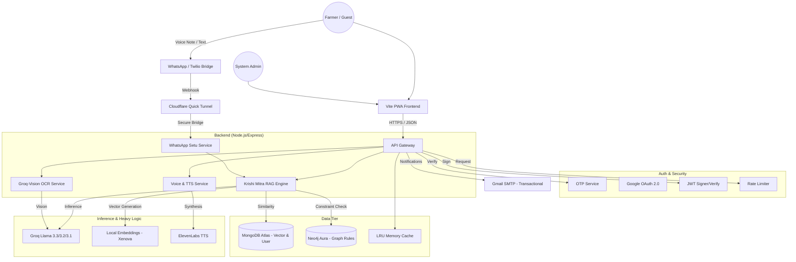
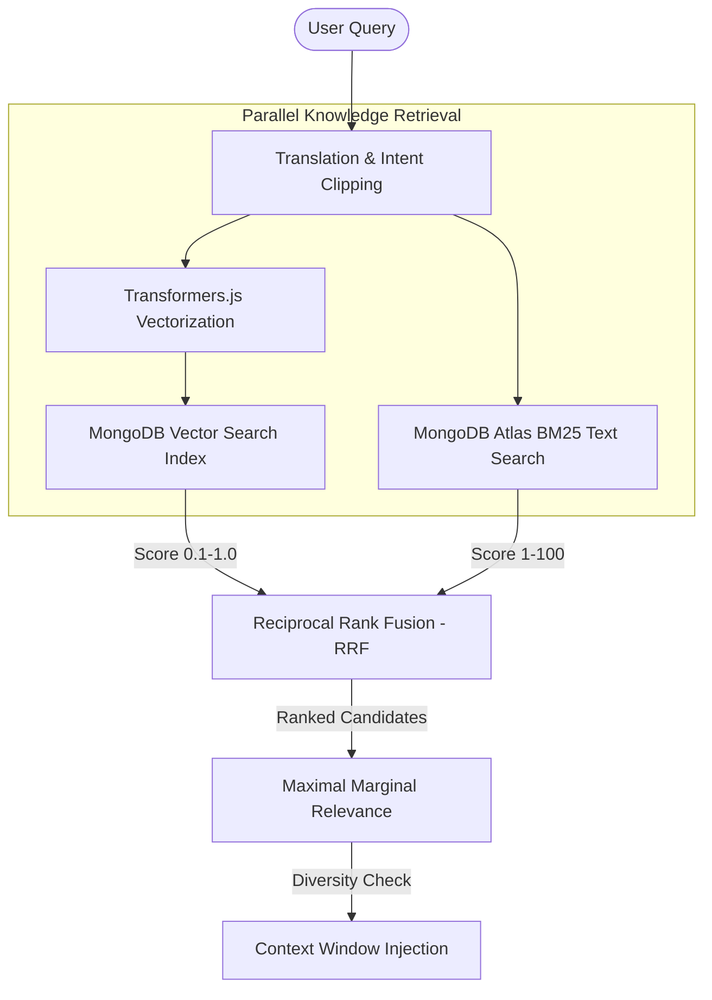
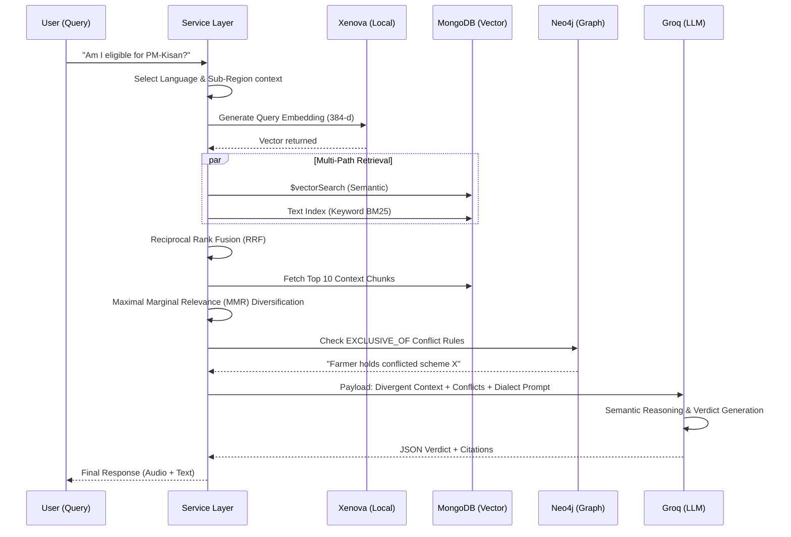
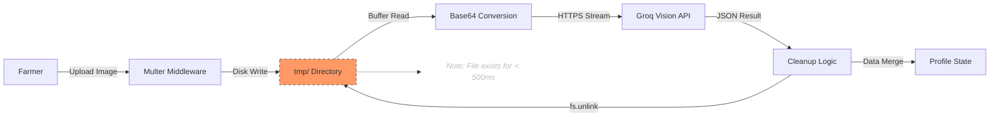
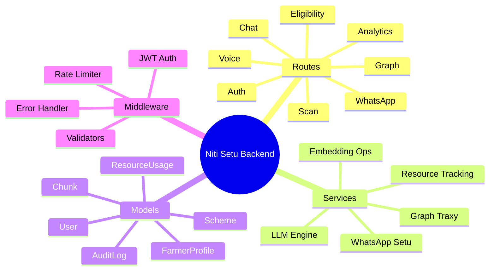

# Niti Setu: System Architecture

Niti Setu is a high-performance, multilingual RAG (Retrieval-Augmented
Generation) ecosystem designed to bridge the accessibility gap in Indian
agricultural schemes. It combines state-of-the-art AI with a privacy-first,
independent, voice-centric UX.

## High-Level System Architecture (HLD)

The platform is built on a modular, decoupled architecture that ensures
scalability and security.

### Key Layers

- **Frontend UI:** React 19, Vite, Framer Motion, **React Bits** - Premium **Glassmorphic** design system, interactive animations, and responsive layouts.
- **Auth & Security:** **OTP**, **Google OAuth**, **JWT** - Secure 2-step registration, social login, stateless session management, and DDOS protection.
- **API Gateway:** Express.js, Node.js - Secure orchestration, file uploading (Multer), and caching (`apicache`).
- **Intelligence:** **Groq Cloud** (Llama 3.3/3.2) - Core reasoning, RAG analysis, and Vision processing with ultra-fast inference speeds.
- **Embeddings:** **Xenova/all-MiniLM-L6-v2** - Local, zero-cost vector embeddings processed via Transformers.js.
- **Vector DB:** **MongoDB Atlas** - Stores users, scheme data, and 1000-character document chunks with rich metadata for `$vectorSearch`.
- **Graph DB:** **Neo4j Aura (Free)** - Relationship mapping for scheme constraints to detect conflicting eligibility (Knowledge Graph).
- **Voice Ops:** Web Speech API, **ElevenLabs** - Multilingual Speech-to-Text (native) and high-fidelity Text-to-Speech synthesis.
- **Email/Comms:** Nodemailer, **Gmail SMTP** - Google Workspace SMTP for reliable transactional delivery of **OTPs**, welcome notices, and alerts.

---

## Technical Deep Dive: Native Multi-Path Retrieval Engine

Niti Setu employs a custom-built, native retrieval pipeline specifically optimized for
legal and policy documentation. We purposely avoid high-level frameworks like **LangChain** or **LlamaIndex** to maintain absolute control over the prompt context and token costs.

### 1. Advanced Ingestion & Chunking Strategy

Unlike standard splitters, we use a **Recursive Character Chunking** strategy:

- **Chunk Size:** 1000 characters.
- **Overlap:** 200 characters (20%).
- **Logic:** The system recursively attempts to split at logical boundaries
  (paragraphs, sentences, then spaces) to maintain context "glue."
- **Uniqueness:** Every chunk is assigned a unique SHA-256 hash to prevent
  duplicate indices even across multiple document versions.

### 2. Hybrid Search & Retrieval

We implement a dual-path retrieval strategy to capture both semantic meaning and
specific keyword terms (like scheme codes or state names):

- **Vector Path:** Uses `all-MiniLM-L6-v2` (via Transformers.js running
  locally) for 384-dimensional semantic similarity.
- **Keyword Path:** Uses MongoDB Atlas Text Search (BM25) for literal matches.
- **Fusion Mixer:** We use **Reciprocal Rank Fusion (RRF)** to combine these
  results, ensuring that if a chunk is relevant in both paths, it is boosted
  to the top.

### 3. Diversity Filtering (MMR)

To prevent the LLM from seeing redundant information, we apply **Maximal
Marginal Relevance (MMR)**:

- It penalizes chunks that are too similar to already selected chunks.
- This ensures the context window contains a diverse range of criteria (e.g.,
  one chunk about age, one about land size, one about crop type).

---

## The Knowledge Base: Source of Truth

The "Brain" of Niti Setu is a multi-layered Knowledge Base (KB) designed to
transform static government policies into actionable intelligence.

### 1. Ground Truth (The PDF Layer)

The KB is seeded with a curated collection of **35+ verified Agricultural
Policy PDFs** spanning **9 priority categories**. These documents serve as the
absolute "Ground Truth." To ensure maximum factual integrity:

- **Direct Ingestion:** Documents are parsed directly from source PDFs to
  prevent manual transcription errors.
- **Version Control:** The system tracks `uploadDates` to ensure farmers are
  checked against the most recent policy revisions.

### 2. Multilingual Facility

Niti Setu is a **Native Multilingual** application, not just translated text:

- **Core Languages:** Hindi, Marathi, Malayalam, Punjabi, Bengali, and
  English.
- **Processing:** Query translation happens at the service layer before
  retrieval, ensuring the RAG engine understands the intent regardless of the
  user's input language.
- **Output:** The LLM generates the eligibility verdict in the user's selected
  language while citing the English/Local source document.

### 3. Factuality & Verifiability

Unlike standard chatbots, Niti Setu follows a **"No Citation, No Answer"** rule.
Every eligibility response is backed by:

- **Verbatim Quotes:** Snippets directly from the KB.
- **Page References:** Exact page numbers from the source PDF.
- **Verified Mirrors:** Links to the primary source file for verification.

---

## Master RAG & Intelligence Sequence

The eligibility determination follows a strict, citation-backed intelligence
pipeline.

### The Two-Phase Pipeline (100% Native implementation)

Niti Setu achieves high performance by bypassing high-level RAG frameworks (LangChain/LlamaIndex) and pre-built hybrid libraries. This native approach ensures:

- **Low Latency:** No framework-overhead between query and inference.
- **Data Sovereignty:** Full control over PII handling without third-party telemetry.
- **Granular Control:** Custom MMR and RRF algorithms specifically tuned for policy text.

- **Ingestion Phase (Admin):**
  - PDFs are parsed and split into **Recursive Character Chunks**.
  - Embeddings are generated **locally** using `Transformers.js` to avoid cloud costs and latency.
  - Chunks are stored with metadata in MongoDB; Category taxonomy is mirrored in Neo4j.

- **Reasoning Phase (Farmer):**
  - The user's query is vectorized.
  - **Native Multi-Path Search:** Vector similarity + Keyword matching.
  - **Bespoke MMR Diversification:** Ensures a broad set of criteria is evaluated.
  - **Direct Graph Conflict Injection:** Neo4j checks for scheme incompatibilities.
  - **LLM Synthesis:** Groq Llama 3.3 generates the verdict with citations.

---

## Ephemeral Privacy-First Data Flow

Privacy is baked into the protocol. We follow a **Zero-Storage** policy for
sensitive documents like Aadhaar or land records.

### Zero-Storage Protocol (Multer Implementation)

- **Ephemeral Uploads:** Using Multer disk-storage, documents are stored in a local `tmp` directory.
- **Stream-Only Processing:** Files are read as a buffer, sent as a base64 binary stream to the Vision model, and **never stored in a database**.
- **PII Stripping:** Logic specifically extracts land/demographic data while ignoring identity-specific numbers.
- **Secure Wipe:** The `finally` block in `scanRoutes.js` executes `fs.unlink` to permanently purge the file within milliseconds of analysis.

---

## Mobile & Device Optimization

Niti Setu is designed with a **Mobile-First** philosophy to ensure farmers can access intelligence on low-bandwidth networks and mid-range smartphones.

### 1. Dynamic Resource Scaling

The platform maintains a high-fidelity desktop experience while automatically "shaving" resource-heavy elements for mobile users.

- **WebGL/Three.js Pruning**: High-intensity background components (Aurora, Silk, Plasma) are strictly disabled on mobile devices to prevent GPU hanging.
- **Animation Decoupling**: Framer Motion transitions and hover effects are bypassed on mobile for instant UI feedback.

### 2. Native Mobile Shell

- **AppShell Architecture**: Implements a slide-in drawer sidebar and a simplified Mobile Header for intuitive navigation on small screens.
- **Touch-Optimized Form Factors**: Increased hit areas (44px+) and 16px font minimums to prevent auto-zooming and mis-taps.

For a deep dive into our mobile optimization strategy, refer to [MOBILE_OPTIMIZATION.md](MOBILE_OPTIMIZATION.md).

---

## Performance & Optimization

### Multi-Layer Caching

To ensure sub-second interaction and reduce AI costs, Niti Setu implements
four distinct caching layers:

1. **Model Cache (Local):** `Transformers.js` caches the 80MB embedding model
   locally.
2. **In-Memory LRU Cache:**
   - `embeddingCache`: Stores vectors for repeated queries.
   - `translationCache`: Stores LLM translation results.
3. **Database-Level Result Cache:**
   - **Private:** Recent results (24h) for same profile/scheme pair bypass AI.
   - **Public:** Deterministic profile hash instantly returns results for
     common demographic queries.
4. **HTTP Middleware Cache:** Uses `apicache` for scheme catalog delivery.

### Resource Tracking & Quota Management

To monitor infrastructure sustainability and costs, Niti Setu implements a **Real-time Quota Monitoring System**:

- **Dual-Category Accounting:** Differentiates between **Registered** (authenticated farmers/admins) and **Public** (anonymous guest) usage for all AI services.
- **Granular Metrics:** Tracks LLM tokens (Groq), Whisper duration (Voice), Vision tokens (OCR), and TTS characters (ElevenLabs) independently.
- **Daily Reset Cycle:** Counters reset at `00:00 UTC` to stay synchronized with external provider billing cycles, while maintaining permanent lifetime registers.
- **Visibility:** Admin-only **Resource Dashboard** provides real-time saturational trend analysis using stacked charts.

### Business & UI Details

- **Freemium Model:** Implements a **1-free public check** limit for anonymous
  users, tracked via `localStorage` and profile hashes.
- **Premium Branding:** System-generated emails feature a **premium,
  independent styled HTML template** with modern tricolor accents.
- **Audit Logger:** Centralized `auditLogger.js` records all administrative
  actions for transparency.

---

## Backend Component Architecture (LLD)

Our code is structured into clear pillars to support production-scale
maintenance.

- **Routes (`/routes`):** Clean API surface (Auth, Eligibility, Voice, Scan, Analytics, Graph, Chat, Profile).
- **Services (`/services`):** The "Brains" where LLM logic, Graph traversal, and Embeddings live.
- **Models (`/models`):** MongoDB schemas for Users, Profiles, Schemes, Chunks, OTPs, ChatSessions, ChatMessages, ResourceUsage, and AuditLogs.
- **Middleware (`/middleware`):** Rate limiters, Joi-based validators, and high-security Auth checks.
