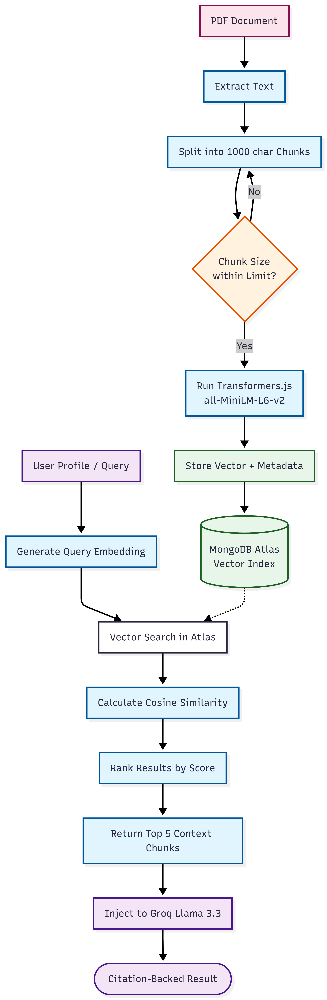
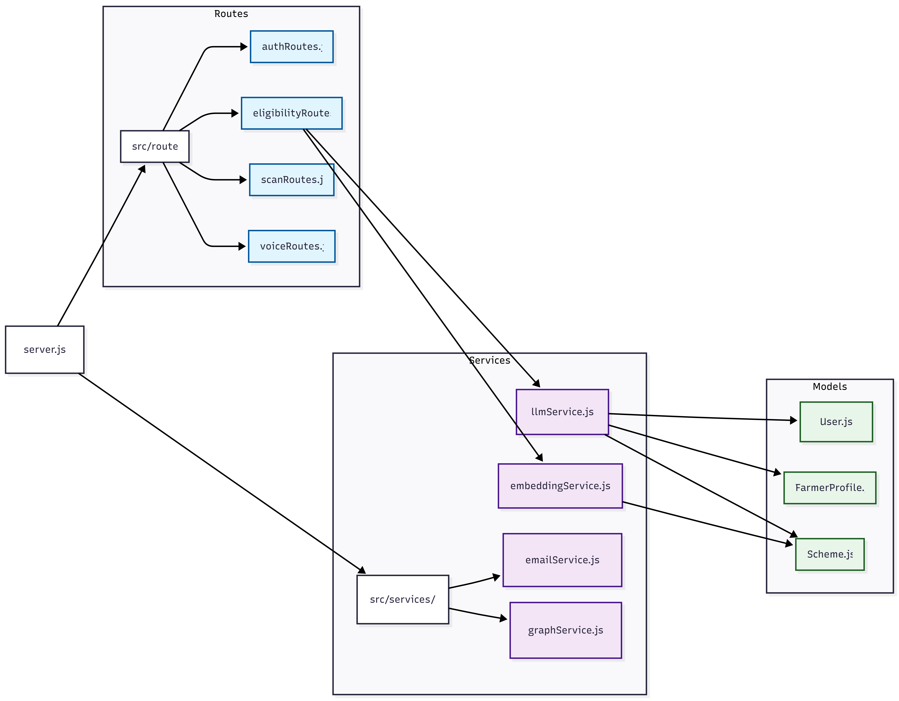

# Backend Documentation: Niti Setu

The Niti Setu backend is a robust Node.js/Express.js service designed to
orchestrate complex AI pipelines and secure data persistence.

## 🧠 AI Orchestration (RAG & Vision)

The core value of the backend lies in its **Custom Native RAG Engine**.

### RAG Pipeline Logic

1. Groq Cloud (Llama 3.3/3.2): We utilize Groq for ultra-fast, low-latency AI inference for reasoning and extracting text from user-uploaded documents (Aadhaar/7-12) as an ephemeral vision stream.
2. Embedding Process: Raw scheme PDFs are parsed and split into overlapping segments (1000 characters, 200 character overlap). We use the `Xenova/all-MiniLM-L6-v2` model via Transformers.js locally to generate 384-dimensional vector embeddings at zero cost.
3. Hybrid Retrieval: Merges Vector similarity scores and Keyword match scores.
4. MMR Re-ranking: Diversifies the top-k chunks to maximize the LLM's context coverage.
5. Dual-Layer Conflict Detection:
   - Hard Conflicts (Neo4j): Intercepts explicitly defined `EXCLUSIVE_OF` business rules.
   - Soft Conflicts (LLM Output): Employs aggressive "Semantic Duplicate Override" prompting to reject conceptually identical scheme overlaps even if string names differ.

## 📊 Database Architecture

- **MongoDB Atlas:**
  - Primary storage for user profiles and scheme data.
  - **Vector Database:** Stores the 1000-character document chunks alongside rich metadata.
  - **Vector Search Index:** Handles the `$vectorSearch` queries using cosine similarity.
- **Neo4j Aura (Free):**
  - Stores the **Agricultural Scheme Taxonomy** as a Knowledge Graph.
  - Enforces **Mutual Exclusion** logic natively. The database seeds over 22+ explicit hard rules preventing farmers from holding cross-sector overlapping schemes (e.g. blocking PMFBY and WBCIS simultaneously).
- **Chat Session Logic:**
  - **ChatSession:** Stores session metadata (title, language).
  - **ChatMessage:** Stores persistent conversation history linked to sessions.

## 🛡️ Security, Auth & Comms

- **OTP-Based Verification:** High-security 2-step verification for all registrations and password resets, utilizing a dedicated `OTP` model with automatic expiration.
- **Identity Verification Gate:** A mandatory account existence check is performed before any password reset OTP is issued. This identifies unauthorized attempts and triggers high-visibility security alerts for invalid users.
- **Strict Password Policy:** Validates all credentials against a high-entropy regex:
  - `minLength: 8`
  - `requirements: [Uppercase, Lowercase, Number, Special Character]`
- **Google OAuth 2.0:** Secure, one-click social login via Passport.js configuration.
- **JWT Authentication:** JSON Web Tokens are used for stateless, secure session management post-login.
- **Rate Limiting:** `express-rate-limit` acts as DDOS protection to prevent API abuse and guard AI processing routes.
- **SMTP & Gmail:** We use `nodemailer` configured with a production **Gmail SMTP** server for real-world delivery of **OTPs** and transactional alerts.
- **Zero-Storage Protocol:** Temporary file storage via Multer with mandatory deletion in `finally` blocks.
- **Admin Data Control (Security Governance):** Administrators can remove farmer profiles via a high-security deletion bridge. This action triggers an automated **Security Termination Email** to the user, citing the **Information Technology Act, 2000 (India)** and providing a formal appeal path to ensure legal transparency.
- **Smart Voice Synchronization:** The backend orchestrates **Groq-Whisper STT** for low-latency transcription. High-level synchronization hooks ensure transcribed text is seamlessly injected into the user's active input field across all UI contexts.

## 📊 Resource Usage Tracking

The system implements a persistent tracking mechanism to monitor external API costs:

- **Mongoose Model (`ResourceUsage.js`):** Centralized schema that stores counters for each external service.
- **Split Benchmarking:** Every API hit is tagged as `registered` or `public` based on the request's authentication state.
- **Automatic Handlers:** Services (LLM, TTS, Voice) automatically increment relevant counters during execution via the `recordUsage` static method.
- **Historical Aggregation:** Maintains a 30-day historical window of usage snapshots.
- **Industrial Telemetry Orchestration:**
  - **Dynamic Resource Merging:** Automated injection of missing service nodes (Groq, ElevenLabs, Whisper, SMTP) ensures a 100% census on the frontend even before the first system action.
  - **Zero-Cache Delivery:** Employs strict `Cache-Control` headers (`no-store`, `no-cache`) for all resource endpoints to ensure real-time accuracy and prevent stale data.

---

## 📂 Directory Structure

- `/src/routes`: API endpoints (eligibility, scan, voice, auth)
- `/src/services`: Business logic (RAG engine, graph traversal, AI calls)
- `/src/models`: Mongoose schemas for MongoDB
- `/src/middleware`: Auth, rate-limiting, and error-handling logic
- `/scripts`: Diagnostic, automation, and database check scripts (e.g., `check-otp.js`)

